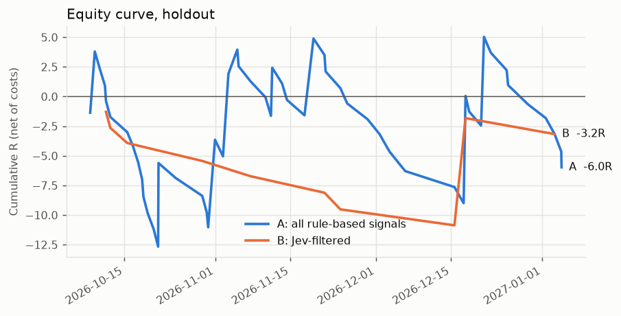
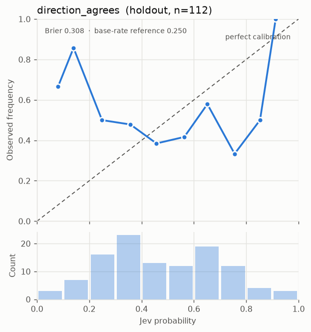
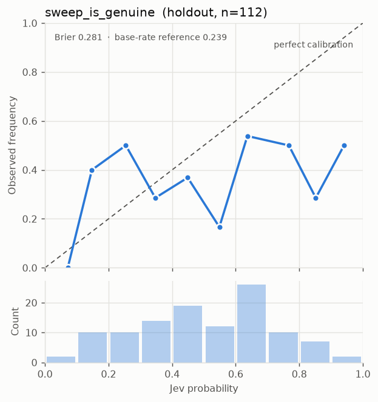
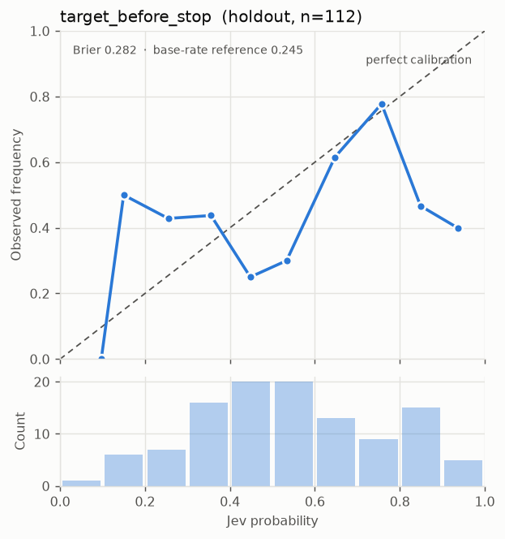

# Eval report: HOLDOUT (evaluated once, reported as-is)

- Data source: `synthetic` · JEV_MODE: `mock` · generated 2026-09-26T21:41:18+00:00
- Period: 2026-01-05 00:00 → 2027-01-04 23:55 UTC; holdout starts 2026-10-05 17:00
- Signals in this split: 112 · risk per trade $25 · config `f7e94b4fc34c`
- target_before_stop threshold: **0.3** (frozen from train on 2026-09-26T21:41:16.422232+00:00)

> **Pipeline check only.** Mock Jev answers are random and/or candles are synthetic. Nothing here says anything about Jev or the market. Expect B ≈ A and Brier ≈ or worse than the base-rate reference.

## A vs B

| Metric | A: all rule-based | B: Jev-filtered |
|---|---|---|
| Trades | 54 | 10 |
| Hit rate | 16.7% | 10.0% |
| Expectancy (R, net) | -0.111 | -0.317 |
| Total R | -5.98 | -3.17 |
| P&L ($) | -149.46 | -79.30 |
| Profit factor | 0.90 | 0.74 |
| Max drawdown (R) | 16.47 | 10.87 |
| Max drawdown ($) | 411.64 | 271.72 |

**Expectancy difference B − A:** -0.206 R, 95% bootstrap CI [-1.856, +2.182]; share of resamples where B is not better: 62.6%.

## Calibration of Jev's Noul answers

Brier: lower is better. The reference always predicts the base rate; skill > 0 means Jev beat it.

| Question | n | Brier | Base-rate reference | Skill | Base rate |
|---|---|---|---|---|---|
| direction_agrees | 112 | 0.308 | 0.250 | -0.234 | 50.9% |
| sweep_is_genuine | 112 | 0.281 | 0.239 | -0.178 | 39.3% |
| target_before_stop | 112 | 0.282 | 0.245 | -0.153 | 42.9% |

## Jev usage

- Scored signals: 112 · mean confidence 0.65 · escalation rate 34.8%
- Regimes: {'trending_down': 31, 'trending_up': 30, 'volatile_chop': 29, 'ranging': 21, 'crisis': 1}
- Mean latency 0 ms · token cost $0.004590

## Decisions

Every take / skip / escalate, with its reason (full log in the `decisions` table and the trades CSV).

- **Arm A:** skip: not_traded (54), take (54), skip: correlated_open (4)
- **Arm B:** skip: setup_quality (53), escalate: confidence (39), take (10), skip: not_traded (7), skip: target_before_stop (3)

Trade log: `trades_holdout.csv`
