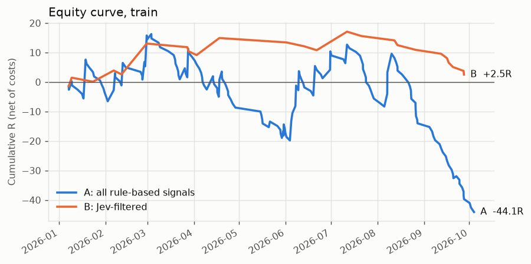
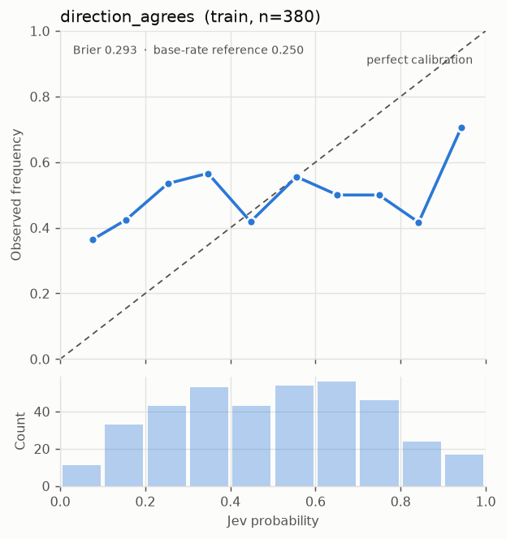
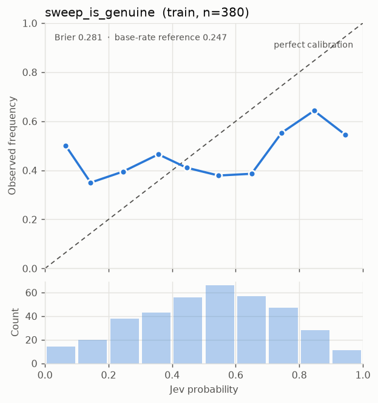
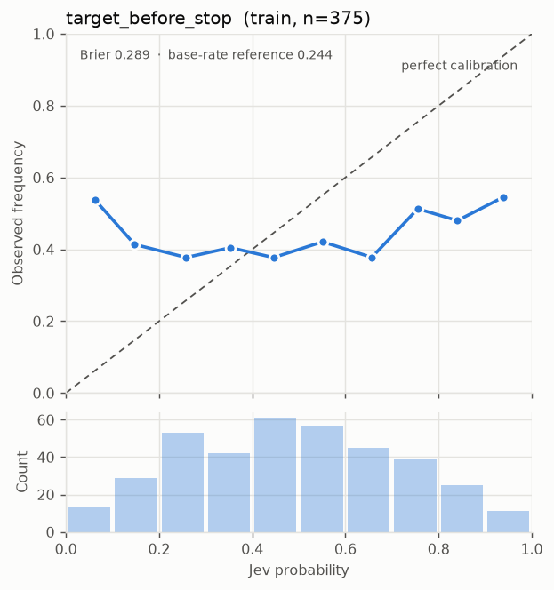

# Eval report: Train

- Data source: `synthetic` · JEV_MODE: `mock` · generated 2026-09-26T21:41:17+00:00
- Period: 2026-01-05 00:00 → 2027-01-04 23:55 UTC; holdout starts 2026-10-05 17:00
- Signals in this split: 380 · risk per trade $25 · config `f7e94b4fc34c`
- target_before_stop threshold: **0.3** (best train expectancy with >= 20 trades)

> **Pipeline check only.** Mock Jev answers are random and/or candles are synthetic. Nothing here says anything about Jev or the market. Expect B ≈ A and Brier ≈ or worse than the base-rate reference.

## A vs B

| Metric | A: all rule-based | B: Jev-filtered |
|---|---|---|
| Trades | 172 | 24 |
| Hit rate | 16.9% | 20.8% |
| Expectancy (R, net) | -0.256 | 0.105 |
| Total R | -44.10 | +2.51 |
| P&L ($) | -1,102.45 | +62.78 |
| Profit factor | 0.78 | 1.09 |
| Max drawdown (R) | 60.36 | 14.56 |
| Max drawdown ($) | 1,508.92 | 363.92 |

**Expectancy difference B − A:** +0.361 R, 95% bootstrap CI [-0.832, +1.839]; share of resamples where B is not better: 30.3%.

## Calibration of Jev's Noul answers

Brier: lower is better. The reference always predicts the base rate; skill > 0 means Jev beat it.

| Question | n | Brier | Base-rate reference | Skill | Base rate |
|---|---|---|---|---|---|
| direction_agrees | 380 | 0.293 | 0.250 | -0.173 | 50.5% |
| sweep_is_genuine | 380 | 0.281 | 0.247 | -0.138 | 44.5% |
| target_before_stop | 375 | 0.289 | 0.244 | -0.184 | 42.1% |

## Jev usage

- Scored signals: 380 · mean confidence 0.66 · escalation rate 35.0%
- Regimes: {'volatile_chop': 101, 'ranging': 98, 'trending_down': 96, 'trending_up': 81, 'crisis': 4}
- Mean latency 0 ms · token cost $0.015571

## Decisions

Every take / skip / escalate, with its reason (full log in the `decisions` table and the trades CSV).

- **Arm A:** skip: not_traded (195), take (172), skip: correlated_open (13)
- **Arm B:** skip: setup_quality (188), escalate: confidence (133), take (24), skip: not_traded (22), skip: target_before_stop (13)

## Threshold search (train only)

| Threshold | Trades | Expectancy (R) |
|---|---|---|
| 0.30 | 24 | 0.105 |
| 0.35 | 24 | 0.105 |
| 0.40 | 21 | -0.062 |
| 0.45 | 18 | 0.158 |
| 0.50 | 15 | 0.468 |
| 0.55 | 14 | 0.610 |
| 0.60 | 14 | 0.610 |
| 0.65 | 14 | 0.610 |
| 0.70 | 12 | 0.962 |
| 0.75 | 11 | 0.789 |
| 0.80 | 7 | 0.386 |

Trade log: `trades_train.csv`
